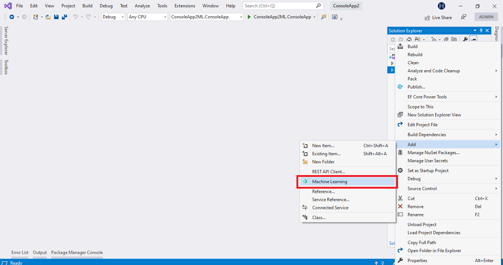
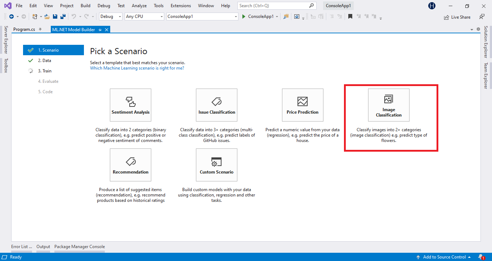
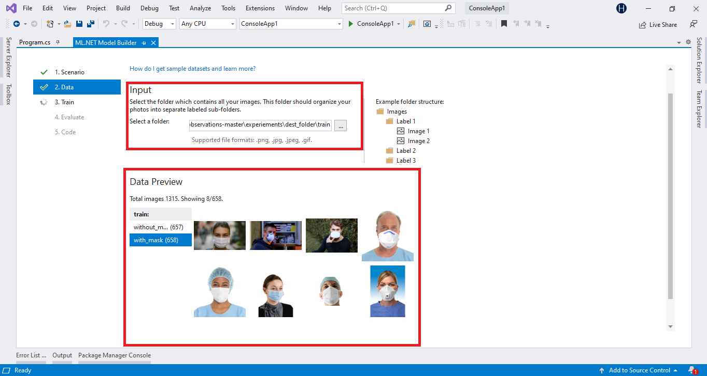
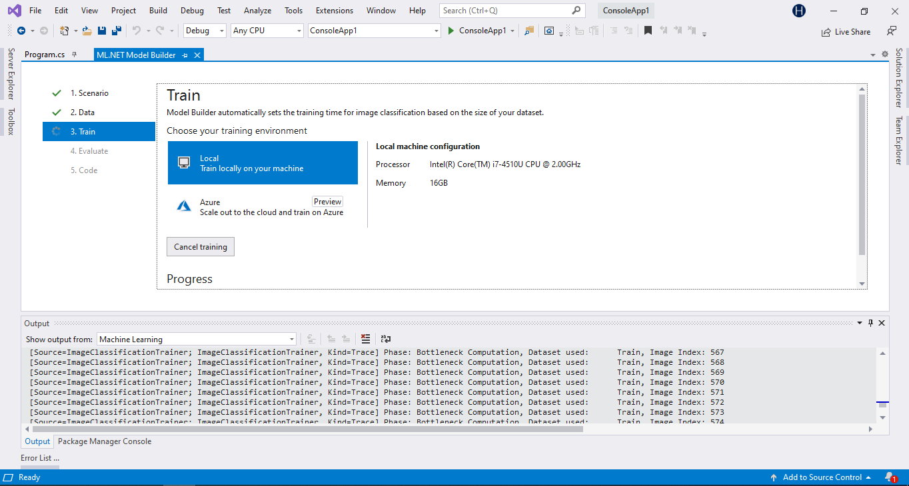
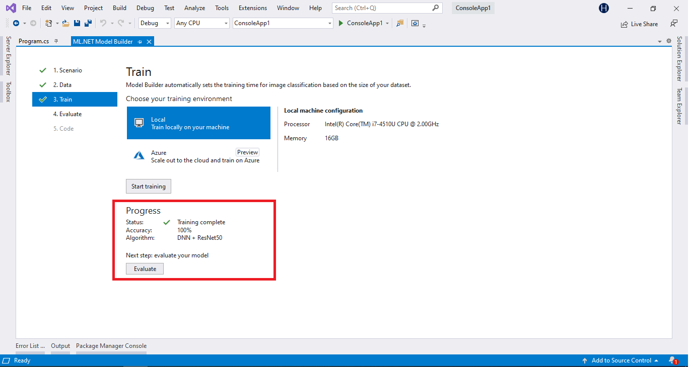
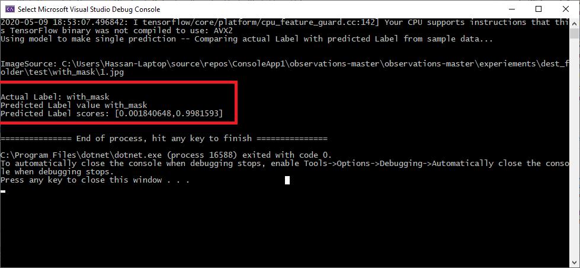
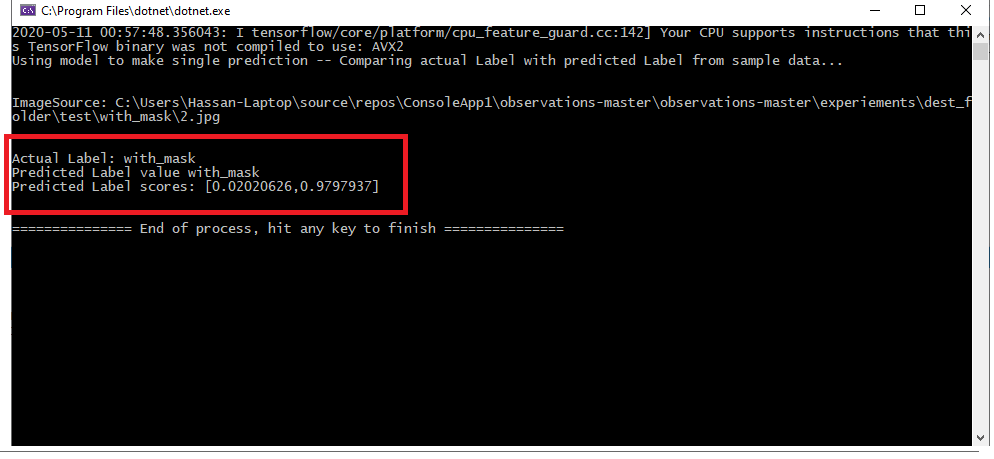

# Face-Mask-Classifier-Using-ML.NET
Face-Mask-Classifier-Using-ML.NET
<!-- wp:paragraph -->

<a rel="noreferrer noopener" href="https://www.microsoft.com/net/learn/apps/machine-learning-and-ai/ml-dotnet" target="_blank">ML.NET</a>&nbsp;is a cross-platform open-source machine learning framework that makes machine learning accessible to .NET developers.

<!-- /wp:paragraph -->

<!-- wp:paragraph -->

ML.NET Model Builder is an intuitive graphical Visual Studio extension to build, train, and deploy custom machine learning models.

<!-- /wp:paragraph -->

 Add Machine Learning to a project

 Pick a Scenario

Data Folder

Train

Training progress

Training Result

Testing Images

